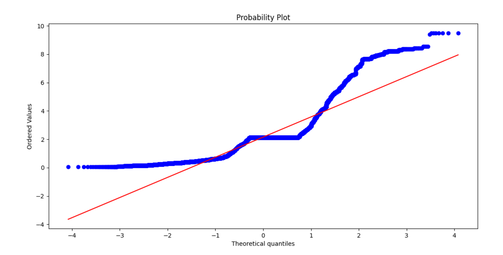
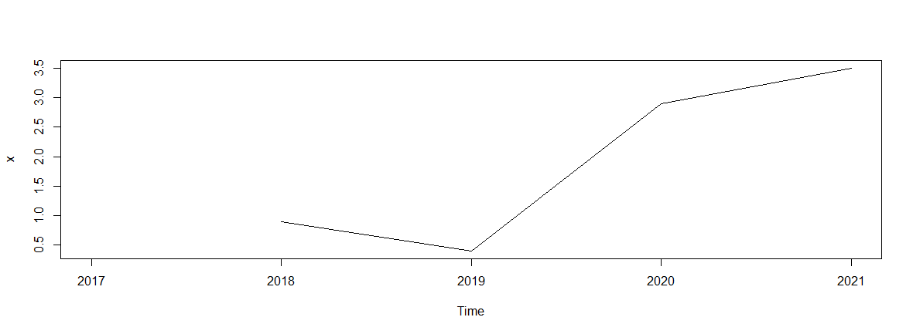
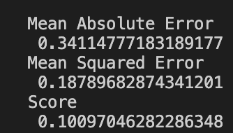

# Market-Munch-Analytics 

## Executive Summary
We are back as a team to continue our analysis of the Online Food Delivery Industry. Last semester we analyzed important factors that influenced the online food delivery market. With the large amount of data, we scrapped last semester and data from multiple sources, we will analyze the in-depth key factors that massively impact this market. Moving on to the second phase of our analysis, we'll look at the main competitors in the online meal delivery sector and see how quickly they're growing. Analyzing their revenues over the last ten years reveals several tendencies that will undoubtedly aid these businesses in their expansion.

The Pandemic has significantly increased the online food delivery industry. Many restaurants have digitally transformed to move online and made sure they keep running their businesses. Ordering food has become very easy, allowing customers access to thousands of restaurants and millions of dishes. Customer retention has become highly challenging with so many on-demand food delivery apps on the market. As a result, the food delivery business must learn about the customer's likes and dislikes to provide incentives and special offers based on their choices. Conducting descriptive statistical and analysis on past and recent reviews, customer's critical considerations can help the online food industry increase their profitability and improve their business. Analyzing and comparing restaurant and app-specific data to collect information on several locations, menu, price, reviews, etc., using various models and visualizations can help discover areas where the individual restaurant and delivery apps can increase their revenues. The global food delivery industry is experiencing explosive growth. The customer’s need for convenient, safe, and contactless food ordering has skyrocketed in the past year with the pandemic. It has led to a rapid rise in the online food delivery industry.

## Statement of Scope
The primary objective of this project is to help restaurants improve their online food delivery businesses by knowing their customers’ expectations, cuisine preferences, likes, and dislikes to provide incentives and special offers based on their choices and feedbacks. For this project, we will be analyzing data from major online food delivery apps like Grubhub, Doordash, UberEats, Postmates across major cities in the United States. The dataset will consist of data from approx. 2000 restaurants from major cities in the United States popular for online food delivery apps. This data will focus on customer reviews, rating, price range, delivery time, and many more. We have also gathered revenue data from the past 10 years to carry out various time series analyses, generate models to get the insights on the overall growth trends.

## Project Objective
The major goal of this project is to discover important aspects of the online meal delivery sector in order to assist businesses succeed and develop. The number of people ordering food online has surged dramatically as a result of the pandemic. As a result, restaurant rivalry is fierce, and any upgrades or modifications that can assist eateries improve are required to stay competitive. The following are some of our goals:

•	Identify and assess areas for improvement in which restaurants may work.

•	Examine how pricing affects the overall statistics of the restaurant and how much price affects the company.

•	Conduct descriptive statistics and analysis on customer reviews to ascertain likes and dislikes, culinary preferences, and general feedback.

•	Determine culinary preferences depending on restaurant location and how changes might affect the company.

•	Evaluate revenue trends and major factors affecting revenues of top restaurants over the past ten years.

•	Evaluate revenue trends and major factors affecting revenues of online food delivery giants over the past ten years.

## Unit of Analysis
Our study results in a win-win situation for both businesses and customers. The insightful and crucial discoveries from our investigation will assist restaurants and food delivery companies in adding, modifying, and changing to meet the demands of their consumers, which will eventually lead to customers ordering meals based on their preferences.

•	Restaurant: This initiative is useful to the restaurant's online meal delivery. Over the last decade, online meal delivery for restaurants has arisen and increased enormously. Multiple powerful organizations are competing for market share, making it critical to keep in touch with your consumers, rivals, market, and industry. In such a case, it is critical to obtain deeper insights on suppliers from client feedback in order to consistently enhance the business's sales and revenues.

•	Customer:  During the pandemic, the number of people ordering meals online has increased dramatically. As a result, customer happiness has become a critical factor in any restaurant's ability to enhance sales and revenues. Customers are happy and satisfied when they obtain their preferred style of cuisine and preferences.

•	Food delivery companies: Over the past decade online food delivery has grown enormously. The growth trends are hugely affected by various methods followed by these organizations. In such a case, it is critical to obtain deeper trends and analyses on growth rate in order to consistently enhance the business's sales and revenues. 

## Variables
To conduct our desired analysis, selecting the correct data variables was very important. The data from our sources was very vast, and we finalized the necessary variables and will play an essential role in our analysis. For the sentiment and text analysis, we scrapped customer reviews, which will help us analyze the crucial feedback from the customers. Furthermore, the Restaurant name, Pin code, Location, and Cuisine will be essential in determining how locations affect the cuisine preferences and which cuisine is famous in which part of the United States. Finally, the Delivery time and Payment methods will help us analyze the preferred payment methods used by the online food delivery apps, also how delivery timings can impact the business. We have also gathered revenue data for each quarter from the past 10 years to evaluate revenue trends and major factors affecting revenues of online food delivery giants.

## Project Schedule
Our team worked for 10 weeks on this project, holding stand-up meetings twice a week for project updates and meeting regularly for 2 hours on Wednesdays to collaborate and address difficulties. Tasks were allocated to each team member depending on their area of expertise. We formed a Teams group to exchange code files, text files, visualizations, and analytic findings.

Below is the Gantt chart, roles and responsibilities of the team for an overview:

|Serial No.|	Name	|Responsibility|
|:---|:---:|:---:|
1.|	Shreya Arora	| Build code for data extraction and scraping in the initial phase of the project.Understanding different models to be built. Validate the model results. Building the identified models. Reporting the model results.
2.| Mayank Talreja	| Created code for data transformation according to the requirements. Supervised in reviewing code and supporting documents. Understanding different models to be built. Building the identified models.Reporting the model results.
3.|	Nitiraj Shitole	| Created code to access the data from several websites. Responsible for delegating tasks and scheduling stand-ups and meetings.  Understanding different models to be built. Building the identified models. Selecting the best model by comparing models.
4.|	Shivanjali Singh	| Responsible for data cleaning and ensuring data integrity across all columns and removing irrelevant data records. Created and maintained documentation of project for better understanding of data. Worked on creating visualizations based on the analysis. Understanding different models to be built. Selecting the best model by comparing models.

## Data Preparation

* [Restaurants_data.csv](data/Restaurants_data.csv): The final datasets generated for this project.
* [scraped_data.csv](data/scraped_data.csv), [scraped_data.txt](data/scraped_data.txt) [scraped_data.txt](data/scraped_data.txt), [sentiments.csv](data/sentiments.csv): The datasets generated for this project from web scrapping.
* [doordashData.py](code/doordashData.py), [grubhubData.py](code/grubhubData.py): Python files used to scrape data from website 
* [dataConsolidation.py](code/dataConsolidation.py): Python file used to consolidate the data from website
* [data_cleaning.R](code/data_cleaning.R): R file used to clean the data from website
* [reduction.r](code/reduction.r): R file used to Reduce the data
* [sentiment_analysis.R](code/sentiment_analysis.R): R file used to perform sentiment analysis
* [sentiment_analysis.py](code/sentiment_analysis.py): Python file used to perform sentiment analysis
* [text_cleaning.py](code/text_cleaning.py): Python file used to clean data
* [text_mining_sentiment_analysis.py](code/text_mining_sentiment_analysis.py): Python file used to sentiment analysis on mined data
* [descriptive_statistics.py](code/descriptive_statistics.py): Python file used to perform descriptive statistics
* [time_series_websites.R](code/time_series_websites.R): R file to perform time series analysis on top online food delivery platforms
* [ann.py](code/ann.py): Python file to perform artificial neural network technique
* [categorical_regression.R](code/categorical_regression.R): R file to perform categorical regression
* [revenue_scraping.py](code/revenue_scraping.py): Python file to scrape revenue for different restaurants

### Data Access
We gathered information from two prominent online meal delivery services in the United States, Grubhub and DoorDash. We also obtained information from a variety of sources, including kaggle.com, statista.com, and others. This dataset provides information from over two thousand restaurants in key cities across the United States. To scrape data from dynamic websites, we utilized Python's Selenium library, CSS Selectors, and XPath Selectors. We have data from 50 restaurants in each city, resulting in 100-400 reviews per business. The information gathered in each city was saved in individual data frames and then consolidated into separate CSV files. We prepared separate CSV files for each city's data from various websites and sources. We also obtained revenue data for key online delivery companies and leading restaurants over the last 10 years, resulting in separate CSV files with over 300 rows of data supporting revenue over the last ten years.

### Data Cleaning
The more accurate the data, the more accurate the result of our analysis. For us data cleaning was one of the most important step, as we have collected data by scraping various websites like Doordash and Grubhub. The main aim of Data Cleaning is to identify and remove errors & exact data to create a reliable dataset. This improves the quality of the data for analysis and enables accurate results. We applied 4 step method to perform data cleaning.

•	Step1: Elimination of erroneous data - The first step was to handle erroneous or irrelevant data in our dataset. Our focus is on to scrutinize reviews and ratings of restaurants based on other deciding factors like delivery fees and time. We evaluated Review column and deleted all the records where the value for review was either purely numeric or some characters e.g., $, #.

•	Step2: Records with missing values - Null values can lead to inaccurate data for testing and training of our model. Logically, there was no point of keeping the data with records which have no review. We deleted this type of records where reviews were null. The same could not be performed for each attribute because this may remove useful information from our target variable. To handle this, we replaced records with suitable value (minimum or average) for columns like delivery time, delivery fee and ratings.

•	Step3: Detection of outliers - Outliers increase the error variance and reduce the power of statistical tests. To check for outliers, we created box plot for respective attributes and used imputation method to deal with outliers. As of now the outliers were replaced by the mean value of that column.

•	Step4: Converting Data types - The data type of every attribute is adjusted to avoid inconsistency and errors while transformation. Zip code is a numerical value but has no use of performing arithmetic operations on it and the numerical values are just a representation of location of any place. We converted data type of Zip code from integer to string. The data generated for revenue was initially in String type, which was converted to data type Date and Numeric respectively.

Stop words, punctuation, numeric values, and white spaces do not add much meaning to a sentence. They can safely be ignored without sacrificing the meaning of a sentence. We used nltk corpus to remove the stop words and created regex for removing punctuations, numeric, and white spaces. Steps for this are: Converting text to lowercase – It is important to convert all the text to lowercase for the text analysis. It was a necessary step to follow that helped us with the consistency of the expected output.

•	Removing stop words – Stop words like “a”, “the”, “are”, “is” etc. It was important to eliminate these stop words from our text as they carry very little useful information.

•	Removing punctuation marks – To refine our data further all the punctuations must be removed as they were not important for text analysis and helped us to make the process smoother.

### Data Transformation
We worked on cleaning the data before converting it and importing it into an application for analysis. We modified the data in order to make it more structured. Transformed data is more usable and may be used to execute a variety of actions. Our dataset went through several modification steps:

•	Categorization - Online food delivery systems utilize the $ unit to denote the pricing range. We translated these numbers to terms such as Low, Moderate, Expensive, and Very Expensive when processing data. Google was used to classify these pricing ranges.

○ $ - Low

○ $$ - Moderate

○ $$$ - Expensive

○ $$$$ - Very Expensive

•	Constructing new attributes - The next stage in data transformation was to create unique attributes for tables. To improve efficiency, we introduced two additional columns to our data: 'Payment Methods' and 'Source.'

•	Modeling and Formatting - The final stage was to model and format the complete dataset. We modified the table and column names for clarity. In addition, the range of pricing parameters for each restaurant was named 'Price Range'. Removed $ sign from revenue generated for restaurants and major online food delivery companies.

### Data Reduction
Data reduction relies on the identification of the dimensions, but makes use of the discovery of the items that comprise the dimensions to reduce the data to fewer variables that represent the latent dimensions. Once the data has been reduced to the fewer number of variables further analysis may become easier to perform and interpret. We have chosen methodology of reducing number of columns is the dataset. In order to do this we performed Principal Component Analysis(PCA) on our cleaned dataset. The results from PCA helped to know our decision in selecting columns of data; i.e. which columns are considered redundant. 

We considered 4 numeric columns that are Rating, DeliveryFees, DeliveryTime and Distance, from our dataset to perform PCA. This process was done in two steps. First we calculated Eigen values to decide which component can be considered. Next to further validate this we created Scree Plot and saw that results were consistent and Scree plot also suggested same. On basis of this analysis we dropped attribute name Distance which suggests distance of restaurant from selected Zip code. If we see this logically also, it does not make much sense and is not an integral part of our research. 

The results from Principal Component Analysis

### Data Consolidation
We have collected data from multiple sources and in different forms. Most of the data was collected by scraping websites. To take our analysis to next stage after performing sentiment analysis we collected some prepared datasets from websites like Kaggle and Statista. As data comes from multiple sources it is sometimes struggling to bring information together for effective Data Analytics. However, insights acquired from data can help in multiple business and industry functions, like understanding customers’ feedback about a new restaurant in the market. But before it can be used for creating reports and running analytics that drives effective decision-making, data must first be aggregated throughout the network and normalized in a single location through Data Consolidation. We took step by step approach to move further. After collecting data, it was cleaned, transformed, and then reduced to make it significant for our analysis. Once the final dataset is prepared our task was to consolidate it. Various data frames were created at different stage and in process of data consolidation all were merged into one data frame. We used CSV format to store our data and the final data frame was exported in csv format by executing a small piece of code.

### Data Dictionary
A short description of the table below. Be sure to link each row to a data file in your directory `data` so I know where it is stored.

Restaurants Data Table

| Attribute Name | Description | Data Type | Source | Example |
|:---|:---|:---:|:---:|:---:|
| Name |	Name of the restaurant based on zip codes.| String | https://www.doordash.com/home, https://www.grubhub.com/home, https://www.kaggle.com, https://www.statista.com/| Chipotle |
| Rating |	Rating of the restaurant out of 5.|	Float	| https://www.doordash.com/home, https://www.grubhub.com/home, https://www.kaggle.com, https://www.statista.com/| 4.5 |
| Review |	Review of all the customers of the restaurant.|	String	|https://www.doordash.com/home, https://www.grubhub.com/home, https://www.kaggle.com, https://www.statista.com/| Very good |
| Pin Code | Pin code of the restaurant location.|	Integer	| https://www.doordash.com/home, https://www.grubhub.com/home, https://www.kaggle.com, https://www.statista.com/| 74075 |
| Location | Location of the restaurant. |	String |	https://www.doordash.com/home, https://www.grubhub.com/home, https://www.kaggle.com, https://www.statista.com/| Stillwater |
| Price Range |	Estimate price of the restaurant at $.|	String	|https://www.doordash.com/home, https://www.grubhub.com/home, https://www.kaggle.com, https://www.statista.com/| Medium |
| Delivery Fees |	Net delivery fees of the restaurant to a specific location.|	String	| https://www.doordash.com/home, https://www.grubhub.com/home,  https://www.kaggle.com, https://www.statista.com/| 2.5 |
| Payment Method |	Method of payment used by the restaurant.|	String	| https://www.doordash.com/home, https://www.grubhub.com/home, https://www.kaggle.com, https://www.statista.com/| PayPal/Credit
| Delivery time	| Total estimated time for the delivery.| 	String	| https://www.doordash.com/home, https://www.grubhub.com/home, https://www.kaggle.com, https://www.statista.com/| 35 |
| Cuisine	| Cuisine of the food that the restaurant delivers.|	String |	https://www.doordash.com/home, https://www.grubhub.com/home, https://www.kaggle.com, https://www.statista.com/| Mexican |

Restaurants Revenue Data Table

| Attribute Name | Description | Data Type | Source | Example |
|:---|:---|:---:|:---:|:---:|
|Date|Restaurant revenue dates from last 10 years|Date|https://www.macrotrends.net/stocks/charts/SBUX/revenue|31-12-2021|
|Revenue|Revenue of restaurants of last 10 years in USD|Integer|https://www.macrotrends.net/stocks/charts/SBUX/revenue|$8,050|
|Restaurants|Restaurant names with respect to their revenue data|String|https://www.macrotrends.net/stocks/charts/SBUX/revenue|Startbucks|

Net Revenue Top 15 Table

| Attribute Name | Description | Data Type | Source | Example |
|:---|:---|:---:|:---:|:---:|
|Date|Restaurant revenue dates from last 10 years|Date|https://www.macrotrends.net/stocks/charts/SBUX/revenue|12-01-2012|
|Revenue ($)|Net Revenue in last 10 years in USD|Integer|https://www.macrotrends.net/stocks/charts/SBUX/revenue|5717|

## Descriptive Statistics and Analysis
The data includes reviews from customers pulled from several online food delivery websites in the 
United States. The words from the reviews were categorized by negative or positive sentiments. 
For example, "good", "right", "love", "great" are categorized as positive; "disappoint", "cold", 
"mess", "bad" are categorized as negative. 

We are using `describe()` function of python pandas library to get the basic descriptive
information for numeric and categorical data. The output provides count, mean, standard deviation,
minimum value, maximum value, and the values for the 25th, 50th, and 75th quartiles for 
`numerical data type` features.

### Numerical Columns
|    | Rating | DeliveryFees | DeliveryTime | Zipcode | Distance |
|:---|:---:|:---:|:---:|:---:|:---:|
|count|30677.00000|30677.00000|30677.00000|30677.00000|30677.00000|
|mean|4.192261|2.471739|36.668253|54779.118264|2.154634|
|std|0.460728|1.793996|10.047710|28238.984404|1.579028|
|min|0.000000|0.000000|0.000000|0.000000|0.000000|
|25%|4.000000|0.990000|30.000000|30311.000000|1.040000|
|50%|4.400000|1.990000|35.000000|48203.000000|2.110657|
|75%|4.500000|2.990000|40.000000|80202.000000|2.110657|
|max|5.000000|9.990000|92.000000|98121.000000|9.500000|

### Categorical Columns
|    | Name | Reviews | PriceRange | Cuisine | Location | PaymentType | Source |
|:---|:---:|:---:|:---:|:---:|:---:|:---:|:---:|
|count|30677|27986|30677|30677|30677|30677|30677|
|unique|1452|23867|5|531|31|2|2|
|top|Chipotle|food good|expensive|Asian|Philadelphia|PayPal/Credit Card|Grubhub
|freq|463|203|13798|5075|1813|27897|27897

We can see from the results that the describe function returns different features such as unique
values, top value and its frequency for the `categorical data type` features.

When we use reviews_data.shape, we get the count of rows and columns of the data. Here, we have 
**30677 rows and 12 columns** as shown below

|30677|12|
|:---|:---|

Also in the `describe` summary of numerical and categorical data we see the `count` statistics
is equivalent to `30677` which shows that there are no NULL values in the data.

__Determine the skewness and kurtosis__

### Skewness
|Rating|-1.276536|
|:---|:---:|
|DeliveryFees|1.128167|
|DeliveryTime|0.684733|
|Zipcode|-0.078045|
|Distance|1.671162|

From the above skewness results, it is evident that `Rating`, `Delivery Fees`, and `Distance` 
attributes are responsible for substantially skewed distribution because its skewness level is 
either greater than +1 or lower than -1. Likewise `Delivery Time` and `Zipcode` are the attributes
which have skewness level almost equivalent to 0, indicating that these attributes are
responsible for normal distribution of data.

### Kurtosis
|Rating|5.609680|
|:---|:---:|
|DeliveryFees|0.896057|
|DeliveryTime|2.721679|
|Zipcode|-1.202527|
|Distance|3.265167|

From the above kurtosis results, it is evident that `Rating`,  `Delivery Time` and `Distance` 
attributes have values much greater than 1 indicating the distribution is too peaked. `Zipcode`
has a value of less than -1 indicating a flat distribution of data.

__Scatter Plots__

The above plot shows the relationship between the delivery fees and the delivery time.
This indicated that delivery fees and delivery time does not have a linear relationship and
are not entirely related to each other. Also, delivery fees is fixed for each restaurant 
irrespective of the location (delivery time) of the restaurant.

The above plot shows the relationship between the delivery fees and the distance. This
indicated that delivery fees and delivery time have a linear relationship and as the
distance increases the delivery fees increases as well.

The above plot shows the relationship between the distance and the delivery time. This
indicated that delivery fees and delivery time have some linear relationship and some
spikes can be observed as delivery time with null values were replaced by the average
delivery time to retain customer reviews.

The above plot shows the relationship between the rating and the price range. This
indicated that for low and medium price range restaurants the ratings are above 3,
whereas the ratings for expensive and very expensive restaurants are not high. This
indicates that price range influences the rating of restaurants.

__BoxPlots__

All the box plots are evident in determining that customer reviews data is very much skewed with
outliers. Since, `delivery fees`, `delivery time`, `distance` and `rating` attributes were 
cramped when plotted together making the assessment difficult, all the attributes are plotted
individually to bring them into focus and below is the analysis for each one of them.

From the above plot it is evident that outliers are present for the delivery fees attribute which
lies above the horizontal bar. These are the data points which are greater than 1.5 times the 
inter-quartile range. Since whisker is shorter on the lower end of the box, the distribution is 
positively skewed.

From the above plot it is evident that outliers are present for the delivery time attribute which
lies above the horizontal bar. These are the data points which are greater than 1.5 times the 
inter-quartile range. Since median is in the middle of the box and the whiskers are about the 
same on both sides of the box, the distribution is symmetric.

From the above plot it is evident that outliers are present for the distance attribute which
lies above the horizontal bar. These are the data points which are greater than 1.5 times the 
inter-quartile range. Since median is overlapping with the top of the box, the distribution
is negatively skewed.

From the above plot it is evident that outliers are present for the rating attribute which
lies below the horizontal bar. These are the data points which are lower than 1.5 times the 
inter-quartile range. Since median is closer to the top of the box and whisker is shorter
on the upper end of the box, the distribution is negatively skewed.

__Bar Plots for Categorical Data__

We used histograms to view the spread of our data. A histogram provides the frequency in which
certain data points appear. We can also use bar plots in place of histograms for categorical
attributes.

From the above bar plot of `Price Range` attribute it is evident that most of the customer reviews
included the text `expensive` in their comments followed by `medium expensive` and least 
number of comments included `very expensive` text in their reviews. It shows that customers
do not complain about the very high prices of the restaurants.

From the above bar plot of `Rating` attribute it is evident that most of the customers gave a 
rating of either `4.5` or `4` and then the number of customers with a rating of `3.5` drastically
dropped to around 3500 and almost zero reviews with `2` rating.

__Assessing Normality (QQ Plots)__

In the quantile-quantile plot, the straight dashed line represents a normal distribution,
the circles represent the data points of your variable

The data points in the above plot do not fall on a straight line instead it forms a curve. This 
indicates that the data is not normally distributed but skewed. Moreover, the curve is bending
below the straight line indicates that the data is skewed right.

The data points in the above plot fall along the straight line in the middle of the graph but curve
off in the extremities. This behaviour usually means data have more extreme values than would be
expected if they truly came from a normal distribution.

The data points in the above plot fall along the straight line in the middle of the graph but curve
off in the extremities. This behaviour usually means data have more extreme values than would be
expected if they truly came from a normal distribution.

The data points in the above plot do not fall on a straight line instead it forms a curve. This 
indicates that the data is not normally distributed but skewed. Moreover, the curve is bending
above the straight line indicates that the data is skewed left.

## Visualizations

**Story 1: Revenue Statistics of Food Delivery Competitors**

The first visualisation story compares income information from various online food delivery firms like
Doordash, Grubhub, Postmates, and Ubereats. This visualization will assist in determining which online 
food delivery platform has emerged as the industry leader in the United States.

`Overview`

| Restaurant Name | Launch Date | HQ | People | Business Type | Industry |
|:---|:---|:---:|:---:|:---:|:---:|
| Doordash | July 2013 | San Francisco, California | Tony Xu (CEO), Andy Fang (CTO), Parbir Adarkar (CFO), Christopher Payne (COO) | Private | Food delivery |
| Grubhub | 2004 | Chicago, Illinois | Matthew Maloney (co-founder, CEO), Adam DeWitt (President, CFO), Maria Belousova (CTO) | Subsidiary | Food delivery |
| Postmates | 1 May 2011 | San Francisco, California | Bastian Lehman (CEO), Sean Plaice (CTO), Dara Khosrowshahi (Uber CEO) | Subsidiary | Food delivery |
| Ubereats | August 2014 | San Francisco, California | Dara Khosrowshahi (CEO), Pierre-Dimitri Gore-Coty (Uber VP, Deliveries) | Subsidiary | Food delivery |

`Key Statistics`

From the above chart we can visualise some key statistics aspects of online food delivery platforms
as follows:
1. DoorDash increased its revenue by 69% to $4.88 billion in 2021
2. Grubhub generated $1.8 billion revenue in 2020, a 39 percent increase year-on-year
3. Grubhub reported a net lost of $155 million in 2020, its largest loss since it went public in 2013
4. Postmates generated $500 million revenue in 2019. We estimate revenue increased to $880 million in 2020, although 
Postmates has not disclosed any official numbers
5. Uber Eats generated $4.8 billion in revenue in 2020, a 152 percent increase year-on-year

Conclusion: Ubereats generated the highest revenue in 2020 which is a 152 percent increase.

**Story 2: Measuring Customer Satisfaction**

The second visualisation story is based on measuring customer satisfaction based on overall
ratings of the restaurants

The graph above depicts the distribution of restaurant ratings for the online food 
delivery business based on customer satisfaction responses. The visualisation shows that the
majority of the responses are distributed around `4` or `4.5` ratings, which is what we would
expect to see. The data contains no noteworthy clusters or anomalies. If the responses are
clustered around the two extremes, we can deduce that there are distinct groups within the
consumer base that are different from the rest. The upper tail of the rating distribution 
indicates that a big portion of the consumer base is satisfied with online meal delivery
services.

**Story 3: Top 15 Restaurants Revenue (2012 - 2021)**

For the years 2012 through 2021, the graph above represents the revenue for the top 15 restaurants.
The most revenue was created in 2019, followed by the second highest revenue in 2021, according
to the visualization. For this report, we also employed an advanced time series model to anticipate 
revenue for the online food delivery industry.

**Visualizing Key Factors**

The distribution of Key factors for our analysis is depicted in the graph above. The distribution of Delivery fees, Rating, Delivery Time, and Distance can be seen in the graph above. The visualization depicts how each variable contains a vast amount of data, as well as how broadly the data is dispersed and the range of data. It reveals that the majority of delivery rates are between 0 and 2 dollars, ratings are between 4-5, delivery time is between 20 and 40 minutes, and distance is typically between 0 and 2 miles . It provides a clear picture of customer and restaurant preferences in general.

## Data Splitting and Sub-Sampling

Sub-Sampling is one of the techniques that we are using when we are building word pairs, and these word pairs are sample training data. The technique of cross-validation belongs to a conventional approach where we avoid overtraining data and ensure good generalization. The basic idea is to divide the dataset into two subsets i.e. training and testing. The training dataset is used to create the models, either in its entirety or as a sub-sample of the training data. The training dataset is also used for evaluating data statistics that are used in certain models, such as the average and the standard deviation of predictor variables used in models created with standardized data. The training set is used only after the model is being built and it is used to compare predictive capabilities across different models and confident estimates to evaluate the model's performance.

In our project, we are performing the data splitting and the proportion that we chose is 70% for the training set and 30% for the testing set. We have made this choice because more training data is a good thing as it makes the classification model better while more test data makes the error estimate more accurate. When we take our dataset into consideration, we have a huge dataset so ideally, we should choose a 70-30 split. We have a higher percent for training data because we want to assure that there is enough data so that we can properly identify the trends for our models as a lower percent for training may not recognize the larger events for classification.

## Modeling Techniques and building the models
Because we all know that time is the most crucial aspect in business performance, our first modeling 
technique will be Time Series Modeling, which will deal with time-based data. We will apply time 
series modeling to uncover hidden revenue insights and make well-informed decisions.

**Model 1: Time Series for revenue forecasting of online food delivery firms**

Before we begin the analysis, we must first familiarize ourselves with the data, which can be found here:

Links:

[doordash revenue data](data/doordash_revenue.txt)

[grubhub revenue data](data/grubhub_revenue.txt)

[postmates revenue data](data/postmates_revenue.txt)

[ubereats revenue data](data/ubereats_revenue.txt)

Because our data does not include seasonal data, it is stationary, implying that the mean and average
sales of various online meal delivery companies remain consistent over time. We used the argument 
`frequency=1` to indicate that the amount of time covered by our data is one year, and the 
argument `start=2017` to indicate that our data begins in 2017.

To evaluate time series data and forecast the results, we employed Holt-Winters exponential smoothing.
The results of Holt-Winters plots and the values generated for the alpha smoothing parameter are
shown below.

**Holt Winters Modeling for Doordash and forecasting its revenue**

Holt Winters modeling for doordash revenue data generates an alpha value of `0.9999`

**Holt Winters Modeling for Grubhub and forecasting its revenue**

Holt Winters modeling for grubhub revenue data generates an alpha value of `0.9996`

**Holt Winters Modeling for Postmates and forecasting its revenue**

Holt Winters modeling for postmates revenue data generates an alpha value of `0.9999`

**Holt Winters Modeling for Ubereats and forecasting its revenue**

Holt Winters modeling for ubereats revenue data generates an alpha value of `0.9999`

**Forecasting revenue for Doordash using Holt-Winters**

**Forecasting revenue for Grubhub using Holt-Winters**

**Forecasting revenue for Postmates using Holt-Winters**

**Forecasting revenue for Ubereats using Holt-Winters**

After that, we performed a constant variance analysis. The residuals for the predicted model must be
evaluated to ensure that they are normally distributed with a mean near to zero and homoscedasticity 
or constant variance.

**Homoscedasticity check for Doordash revenue data**

**Homoscedasticity check for Grubhub revenue data**

**Homoscedasticity check for Postmates revenue data**

**Homoscedasticity check for Ubereats revenue data**

Conclusion: The revenue data for all of the websites shows heteroscedasticity, or non-constant variation,
rather than homoscedasticity. The data is not evenly distributed around the mean, which is represented 
by the red line.

Our next step is to assess the normality of the residuals and below are the results:

**Normal Distribution check for Doordash revenue data**

**Normal Distribution check for Grubhub revenue data**

**Normal Distribution check for Postmates revenue data**

**Normal Distribution check for Ubereats revenue data**

Conclusion: Actual data deviates greatly from the desired normal distribution curve in any of the 
above normal distribution charts, indicating that data is not normally distributed for any of the 
online food delivery platforms.

**Model 2: ARIMA Time Series**

An Autoregressive Integrated Moving Average (ARIMA) model is another one of our models. We gathered data from the top 15 restaurants in the United States. This data includes monthly revenue over the previous 9 years. Our goal is to anticipate the food industry's income based on the top 15 restaurants in the United States. This allows us to forecast revenue in the following years and, based on our other research, suggest a solution for eateries.

When projecting, one of the first places to examine is our sales history, as well as inventory and production records. Because a past data point in time may influence each subsequent data point, this model was chosen. That is, the current event analyzed is correlated with an event in the past and revenue is one such attribute for which forecasting must be done using historical data.
Below is the link to the dataset used for our analysis purposes.

Every year, the food business experiences a gain or loss at some point. This is referred to as seasonality, and we've observed it in revenue as well. The first step was to decompose our time series object to find the seasonal component. The following are the outcomes for the same.

The graph below depicts only seasonality component.

The boxplot generated below depicts the seasonality in our time ordered data.

The plot normal distribution with seasonal and without seasonal is show below.

[arima](assets/normaldistribution_totalrevenue.png)

We seek stationarity after removing seasonality from our data. A process that has a propensity to revert to the average value of a time series is referred to as stationary. This means that the data's mean and variance remain constant over time.

The Augmented Dickey-Fuller (ADF) t-test and the Kwiatkowski-Phillips-Schmidt-Shin (KPSS) test are used to determine stationarity. The following are the outcomes:

After differencing these are the results of ADF and KPSS tests, which shows that our time series object has stationarity.

We differenced our time series object three times to remove non-stationarity from the data, giving us a degree of differencing of 3.

After that, we needed to look at correlation to see if there was an autoregressive component or a moving average. We produced acf and pacf plots to aid in the identification of these components.

**Model 3: Regression Categorical**

We have a lot of categorical variables in our data, and one of them is price range, which has values 
like `low`, `medium`, `expensive`, and `very expensive`. We need to create categorical data to analyze 
these variables, so our next modeling technique is regression categorical.
The following is the data that was utilized to do categorical regression:

Links:

[customer reviews](data/scraped_data.csv)

The dependent or target variable in our model is `Rating`, while the independent variables are 
`payment type` and newly constructed indicator variables from the `price_range`, namely `pr_low`,
`pr_medium`, `pr_expensive`, and `pr_veryexpensive`.

In our first phase of the project, we also binned the price range variable, resulting in values 
such as low, medium, expensive, and very expensive.

Next, we created a regression model that is quite similar to multiple regression except that the 
linear regression assumptions are not tested. A linear relationship is not conceivable because these 
columns are binary.

Payment type and price range indicator variables will be used in the regression equation. Four new 
columns were added to the dataframe when the price range indicator variables were established. 
We also used R's summary function to examine the regression model's results.

The significant factors are `payment_type`, `pr_low`, and `pr_medium`, as seen in the above graph, 
indicating that our present set of independent variables accurately identifies the significance when 
predicting the rating. `pr_expensive` and `pr_veryexpensive` are not significant factors, 
as one might expect.

**Model 4: Artificial Neural Networks**

We used ANN to do regression and classification modeling for the fourth modeling technique.
To partition the data into training and testing subsamples, we used the built-in Python module.
The dependent variable in the regression neural network will be `rating`, while the independent
variables will be `delivery fees`, `delivery time`, `zipcode`, `distance`, and `revenue`. 
The data was split into training and testing samples with a 70:30 ratio using the function train 
test split().

Another crucial step is to scale the data such that all the neural network's inputs have the same 
impact. Because our data is linear, we applied the activation function RELU, which can result in 
significant reductions in errors.

The preceding graph reveals that the sum of mean absolute error and mean squared error is `0.529`,
which is significantly low, and the accuracy score is `0.101`

We also employed ANN classification as a modeling tool. The target variable for this model is 
`price_range`, which is categorical, and the independent variables are `Rating`, `Delivery Time`, 
`Delivery Fees`, `Zipcode`, `Revenue`, and `Distance`. We also divided the data into training and testing
sections, with a ratio of 80% and 20%, respectively. The training data is used to scale.

## Assess the Models

**Assessment for time series for revenue forecasting of online food delivery firms**

Conclusion: We know that a bigger smoothing parameter emphasizes recent demand and produces a 
prediction that is more responsive to real demand changes; a smaller alpha emphasizes demand more 
uniformly and produces a forecast that is more stable and less responsive to actual demand changes. 
According to our findings, doordash, postmates, and ubereats have the greatest smoothing parameter 
values, indicating that these platforms' forecasting is very responsive to changes in actual demand.

**Assessment for ARIMA Time Series**

Then, using auto.arima(), we found the optimal ARIMA model for our time series object. 
This function returned two models: ARMA(2,0,0) and ARMA(0,0,0). To choose the best among these, 
we assessed the BIC value of each model and discovered that the BIC value for model ARMA(2,0,0) 
was the lowest in 1853. As a result, ARIMA was chosen as the model for our time series object (2,3,0).
The number 3 denotes the degree of differencing, I.

Finally, we anticipated revenue for the following four years using our best model and determined the 
accuracy of our forecasted model. Our predicting results were confirmed to be an accurate and minimum
error. The revenue estimate for the next four years is shown below.

**Assessment for Regression Categorical**

The adjusted r squared value of the model is 0.04398, which is very low, indicating 
that the data variance is low and the model accuracy is excellent. The model's p-value is 2.2e-16.

**Assessment for Artificial Neural Networks**

Along with the classification report, a confusion matrix in text form and a gradient color based 
form are also generated and provided below:

According to the aforementioned confusion matrix, actual low price results are 0 while forecasted 
low price outcomes are 13. The actual results for the medium price range are 3720, whereas the 
anticipated results for the medium price range are 3779. Actual expensive results are 2416, but expected
expensive results are 2333; actual very expensive results are 0 and predicted very expensive results are 11. 
As a result, the precision of the results is:
low price = 0/13 = 0
medium price = 3720/3779 = 0.98
expensive = 2416/2333 = 1.04
very expensive = 0/11 = 0

The model's accuracy is 66 percent, according to the classification report, 
using 80 percent training data and 20 percent testing data.

## Conclusion and Discussion

After cleaning, converting, consolidating, and decreasing data from diverse sources, we used descriptive statistics to summarize, show and analyze the data and make it more understandable. We have used few general types of statistical measures to describe the numerical data such as measures of central tendency (mean, median, mode), measures of variation (range, standard deviation, and interquartile range), number summary (first quartile, second quartile, third quartile, minimum, maximum), shape of data (symmetric, left skewed, right skewed).

From this analysis, we concluded that for symmetrically shaped data that is Rating and Distance attributes, the mean and median are same. Also, these results are aligned with the QQ plots of Rating and Distance. The QQ plot of distance attribute is symmetric with the central line in the middle and QQ plot of rating attribute is lightly skewed left.

In our proposed solution, we took into consideration the various features of the datasets for the prediction. The input features were ordered based on their impact on the target attribute which was the restaurant revenue. Various other pre-processing techniques like Principal Component Analysis (PCA) have been used.

Our examination of the leading online food delivery platforms revealed that ubereats had the largest
revenue increase from 2017 to 2021, which was confirmed when we compared the results to real-time
data, demonstrating that our time series model for revenue forecasting is the most accurate.
ARIMA time series model was found to be the best performing model for revenue prediction when compared to linear regression model.

This brings up the lesson that it’s very important to understand the data you’re working with dataset. We had also played around with many models, manually tweaking hyper-parameters until we discovered grid search which did wonders on saving time and effort in finding the best model. These were just some of the few things we learned while working on this dataset. A few things perhaps to try in the future would be to fit models on relevant features and including a more diverse ensemble of models.

## References

Data Sources:

https://www.statista.com/outlook/dmo/eservices/online-food-delivery/united-states

https://www.businessofapps.com/data/doordash-statistics/

https://www.businessofapps.com/data/grubhub-statistics/

https://www.businessofapps.com/data/uber-eats-statistics/

https://www.kaggle.com/
